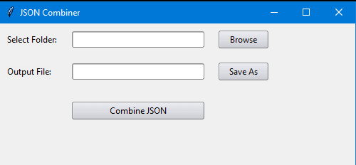

# JSON Combiner
Combine Multiple JSON Files of the same structure

## Instructions:
Put whatever JSON files that need to be appended to one another into a folder of their own.

Run the JSONCombiner.py script to pull up the python GUI. Optionally, convert the script to an .exe file for long-term use.

From the Python GUI, select the location of the folder contianing all files and set a name for the combination file, which outputs into the JSONCombiner Folder. 

